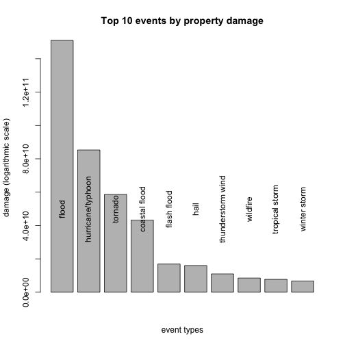

# Synopsis

In this report we investigate which severe weather events are most harmful to the
population and which have the greatest economic consequences. Our analysis is based
on data obtained from the US National Oceanic and Atmospheric Administration. From this
data we find that the 5 categories of events with most human fatalities are: `tornado`,
`excessive heat`, `heat`, `flash flood` and `lightning`. The 5 categories of events with
most injured subjects are: `tornado`, `thunderstorm wind`, `flood`, `excessive heat` and `lightning`.
The 5 categories of events which are most harmful to property are: `flood`, `hurricane/typhoon`, `tornado`,
`coastal flood` and `flash flood`. The 5 categories of events most detrimental to agriculture are:
`drought`, `flood`, `hurricane/typhoon`, `ice` and `hail`.

# Data Processing

We download the data:


```r
file_url <- "https://d396qusza40orc.cloudfront.net/repdata%2Fdata%2FStormData.csv.bz2"
download.file(file_url, destfile = "StormData.bz2", method="curl")
```
and use `bunzip2` (on the shell) to decompress the file. We then load libraries:


```r
library(dplyr)
library(lubridate)
library(xtable)
library(ggplot2)
```

We report the `Sys.info()`


```r
info_string <- Sys.info()
cat(paste(paste("sysname:", info_string["sysname"]), 
           paste("release:",info_string["release"]), 
            paste("machine:", info_string["machine"]), sep="\n"))
```

```
## sysname: Darwin
## release: 14.4.0
## machine: x86_64
```

```r
R.version
```

```
##                _                           
## platform       x86_64-apple-darwin13.4.0   
## arch           x86_64                      
## os             darwin13.4.0                
## system         x86_64, darwin13.4.0        
## status                                     
## major          3                           
## minor          2.0                         
## year           2015                        
## month          04                          
## day            16                          
## svn rev        68180                       
## language       R                           
## version.string R version 3.2.0 (2015-04-16)
## nickname       Full of Ingredients
```

and then read the data in R; note that we filter in `cleaning_data` only the columns we are
interested in and use lubridate to properly format the dates.


```r
storm_data <- read.csv("storm_data.csv", header = TRUE, stringsAsFactors=FALSE)
names(storm_data)<-tolower(names(storm_data))
storm_data$evtype <- tolower(storm_data$evtype)
cleaning_data <- select(storm_data, evtype, bgn_date, end_date, fatalities, injuries, propdmg,
                        propdmgexp, cropdmg, cropdmgexp, state)
cleaning_data$bgn_date <- mdy(sub(patter = " 0:00:00", replacement = "", cleaning_data$bgn_date))
cleaning_data$end_date <- mdy(sub(patter = " 0:00:00", replacement = "", cleaning_data$end_date))
```

The data frame `cleaning_data` denotes the data that will be cleaned. 
We need to clean the column
`evtype`, each of whose entries should take value in one of the "main categories" of severe
weather events in Section 7 of
the [Storm Data Documentation](https://d396qusza40orc.cloudfront.net/repdata%2Fpeer2_doc%2Fpd01016005curr.pdf).
However, we have chosen to keep some additional categories. The details of the cleaning are discussed
in the Section **R Code**. From now on we assume that `cleaning_data` has been cleaned.

To compute the values of property and crop damage, we need to convert the exponents in
the columns `propdmgexp`, `cropdmgexp` to integral values.
Note that the only values of the exponents which are meaningful
are: `H/h`, `k/K`, `m/M` and `B`.


```r
prop_vec <- c("-"=0, "?"=0, "+"=0, "0"=0, "1"=0, "2"=0, "3"=0, "4"=0, "5"=0, "6"=0, "7"=0,
              "8"=0, "B"=10^9, "h"=10^2, "H"=10^2, "K"=10^3, "M"=10^6, "m"=10^6, "k"=10^3)
cleaning_data$propdmgexp <- prop_vec[cleaning_data$propdmgexp]
cleaning_data$cropdmgexp <- prop_vec[cleaning_data$cropdmgexp]
```

We then create new columns `property` and `crop` which contain the damages created by the events.


```r
cleaning_data <- mutate(cleaning_data, property = propdmg * propdmgexp, crop = cropdmg * cropdmgexp)
```

We finally create summaries by taking for the columns `injuries`, `fatalities`, `property` and `crop` the
sum, mean and standard deviation across the events in each category. We then join the tables of means and
standard deviations.


```r
storm_totals <- group_by(cleaning_data, evtype) %>%
	         summarise(fatalities = sum(fatalities, na.rm=TRUE), injuries = sum(injuries, na.rm=TRUE),
		       property = sum(property, na.rm=TRUE), crop = sum(crop, na.rm=TRUE))
storm_means<- group_by(cleaning_data, evtype) %>%
               summarise(fatalities = mean(fatalities, na.rm=TRUE), injuries = mean(injuries, na.rm=TRUE),
	             property = mean(property, na.rm=TRUE), crop = mean(crop, na.rm=TRUE))
storm_sds<- group_by(cleaning_data, evtype) %>%
             summarise(sdfatalities = sd(fatalities, na.rm=TRUE), sdinjuries = sd(injuries, na.rm=TRUE),
	           sdproperty = sd(property, na.rm=TRUE), sdcrop = sd(crop, na.rm=TRUE))
storm_means <- inner_join(storm_means, storm_sds)
```

# Results

## Danger for humans
We select and sort the top 10 causes of total fatalities, and use total injuries to break ties.


```r
topt_fatalities <- arrange(storm_totals, desc(fatalities), desc(injuries))[1:10,1:3]
topt_fatalities$fatalities <- as.integer(topt_fatalities$fatalities)
topt_fatalities$injuries <- as.integer(topt_fatalities$injuries)
```

We then show the results in a table.


```r
options(xtable.comment=FALSE)
topt_fat_table <- xtable(topt_fatalities)
print(topt_fat_table, include.rownames=FALSE, type='html')
```

<table border=1>
<tr> <th> evtype </th> <th> fatalities </th> <th> injuries </th>  </tr>
  <tr> <td> tornado </td> <td align="right"> 5661 </td> <td align="right"> 91407 </td> </tr>
  <tr> <td> excessive heat </td> <td align="right"> 2018 </td> <td align="right"> 6680 </td> </tr>
  <tr> <td> heat </td> <td align="right"> 1116 </td> <td align="right"> 2531 </td> </tr>
  <tr> <td> flash flood </td> <td align="right"> 1035 </td> <td align="right"> 1802 </td> </tr>
  <tr> <td> lightning </td> <td align="right"> 817 </td> <td align="right"> 5232 </td> </tr>
  <tr> <td> thunderstorm wind </td> <td align="right"> 730 </td> <td align="right"> 9542 </td> </tr>
  <tr> <td> rip current </td> <td align="right"> 572 </td> <td align="right"> 529 </td> </tr>
  <tr> <td> flood </td> <td align="right"> 518 </td> <td align="right"> 6881 </td> </tr>
  <tr> <td> high wind </td> <td align="right"> 325 </td> <td align="right"> 1585 </td> </tr>
  <tr> <td> cold/wind chill </td> <td align="right"> 237 </td> <td align="right">  41 </td> </tr>
   </table>

We select and sort the top 10 causes of total injuries, and use total fatalities to break ties.


```r
topt_injuries <- arrange(storm_totals, desc(injuries), desc(fatalities))[1:10,c(1,3,2)]
topt_injuries$fatalities <- as.integer(topt_injuries$fatalities)
topt_injuries$injuries <- as.integer(topt_injuries$injuries)
```

We then show the results in a table.


```r
options(xtable.comment=FALSE)
topt_inj_table <- xtable(topt_injuries)
print(topt_inj_table, include.rownames=FALSE, type='html')
```

<table border=1>
<tr> <th> evtype </th> <th> injuries </th> <th> fatalities </th>  </tr>
  <tr> <td> tornado </td> <td align="right"> 91407 </td> <td align="right"> 5661 </td> </tr>
  <tr> <td> thunderstorm wind </td> <td align="right"> 9542 </td> <td align="right"> 730 </td> </tr>
  <tr> <td> flood </td> <td align="right"> 6881 </td> <td align="right"> 518 </td> </tr>
  <tr> <td> excessive heat </td> <td align="right"> 6680 </td> <td align="right"> 2018 </td> </tr>
  <tr> <td> lightning </td> <td align="right"> 5232 </td> <td align="right"> 817 </td> </tr>
  <tr> <td> heat </td> <td align="right"> 2531 </td> <td align="right"> 1116 </td> </tr>
  <tr> <td> ice </td> <td align="right"> 2159 </td> <td align="right"> 101 </td> </tr>
  <tr> <td> flash flood </td> <td align="right"> 1802 </td> <td align="right"> 1035 </td> </tr>
  <tr> <td> wildfire </td> <td align="right"> 1608 </td> <td align="right">  90 </td> </tr>
  <tr> <td> high wind </td> <td align="right"> 1585 </td> <td align="right"> 325 </td> </tr>
   </table>

An alternative approach is to find the events which in mean are most harmful. In fact,
there might be events which are extremely dangerous, but also rare and so they are penalized
in taking the sum of total fatalities / injuries. However, to account for variability, we also
report standard deviations.

We find the top 10 events which have most fatalities in mean.


```r
topm_fatalities <- arrange(storm_means, desc(fatalities), desc(injuries))[1:10,c(1,2,3,6,7)]
```


```r
topm_fat_table <- xtable(topm_fatalities)
print(topm_fat_table, include.rownames=FALSE, type='html')
```

<table border=1>
<tr> <th> evtype </th> <th> fatalities </th> <th> injuries </th> <th> sdfatalities </th> <th> sdinjuries </th>  </tr>
  <tr> <td> tsunami </td> <td align="right"> 1.65 </td> <td align="right"> 6.45 </td> <td align="right"> 7.15 </td> <td align="right"> 28.85 </td> </tr>
  <tr> <td> high seas </td> <td align="right"> 1.23 </td> <td align="right"> 1.00 </td> <td align="right"> 1.09 </td> <td align="right"> 1.68 </td> </tr>
  <tr> <td> heat </td> <td align="right"> 1.17 </td> <td align="right"> 2.65 </td> <td align="right"> 18.99 </td> <td align="right"> 19.62 </td> </tr>
  <tr> <td> excessive heat </td> <td align="right"> 1.06 </td> <td align="right"> 3.49 </td> <td align="right"> 4.71 </td> <td align="right"> 24.59 </td> </tr>
  <tr> <td> rip current </td> <td align="right"> 0.74 </td> <td align="right"> 0.68 </td> <td align="right"> 0.63 </td> <td align="right"> 2.29 </td> </tr>
  <tr> <td> avalanche </td> <td align="right"> 0.58 </td> <td align="right"> 0.44 </td> <td align="right"> 0.78 </td> <td align="right"> 1.03 </td> </tr>
  <tr> <td> high water </td> <td align="right"> 0.50 </td> <td align="right"> 0.00 </td> <td align="right"> 0.84 </td> <td align="right"> 0.00 </td> </tr>
  <tr> <td> hurricane/typhoon </td> <td align="right"> 0.44 </td> <td align="right"> 4.44 </td> <td align="right"> 1.59 </td> <td align="right"> 48.88 </td> </tr>
  <tr> <td> coastal storm </td> <td align="right"> 0.36 </td> <td align="right"> 0.18 </td> <td align="right"> 0.50 </td> <td align="right"> 0.40 </td> </tr>
  <tr> <td> marine strong wind </td> <td align="right"> 0.29 </td> <td align="right"> 0.46 </td> <td align="right"> 0.54 </td> <td align="right"> 1.37 </td> </tr>
   </table>

We find the top 10 events which have most injuries in mean.


```r
topm_injuries <- arrange(storm_means, desc(injuries), desc(fatalities))[1:10,c(1,3,2,7,6)]
```


```r
topm_inj_table <- xtable(topm_injuries)
print(topm_inj_table, include.rownames=FALSE, type='html')
```

<table border=1>
<tr> <th> evtype </th> <th> injuries </th> <th> fatalities </th> <th> sdinjuries </th> <th> sdfatalities </th>  </tr>
  <tr> <td> tsunami </td> <td align="right"> 6.45 </td> <td align="right"> 1.65 </td> <td align="right"> 28.85 </td> <td align="right"> 7.15 </td> </tr>
  <tr> <td> glaze </td> <td align="right"> 4.80 </td> <td align="right"> 0.16 </td> <td align="right"> 12.02 </td> <td align="right"> 0.77 </td> </tr>
  <tr> <td> hurricane/typhoon </td> <td align="right"> 4.44 </td> <td align="right"> 0.44 </td> <td align="right"> 48.88 </td> <td align="right"> 1.59 </td> </tr>
  <tr> <td> excessive heat </td> <td align="right"> 3.49 </td> <td align="right"> 1.06 </td> <td align="right"> 24.59 </td> <td align="right"> 4.71 </td> </tr>
  <tr> <td> heat </td> <td align="right"> 2.65 </td> <td align="right"> 1.17 </td> <td align="right"> 19.62 </td> <td align="right"> 18.99 </td> </tr>
  <tr> <td> tornado </td> <td align="right"> 1.51 </td> <td align="right"> 0.09 </td> <td align="right"> 17.17 </td> <td align="right"> 1.42 </td> </tr>
  <tr> <td> freezing fog </td> <td align="right"> 1.25 </td> <td align="right"> 0.11 </td> <td align="right"> 5.77 </td> <td align="right"> 0.60 </td> </tr>
  <tr> <td> ice </td> <td align="right"> 1.02 </td> <td align="right"> 0.05 </td> <td align="right"> 34.23 </td> <td align="right"> 0.33 </td> </tr>
  <tr> <td> dust storm </td> <td align="right"> 1.00 </td> <td align="right"> 0.05 </td> <td align="right"> 4.24 </td> <td align="right"> 0.53 </td> </tr>
  <tr> <td> high seas </td> <td align="right"> 1.00 </td> <td align="right"> 1.23 </td> <td align="right"> 1.68 </td> <td align="right"> 1.09 </td> </tr>
   </table>

The next plot shows the top 10 causes of fatalities.


```r
gfat <- barplot(topt_fatalities$fatalities, main = "Top 10 events by total fatalities",
     xlab = "event types", ylab = "total fatalities")
text(x = gfat, y = rep(2500,10), labels=topt_fatalities$evtype, srt=90)
```

 

## Danger for property

We select the top 10 causes of damage to property, and use damage to crop to break ties.


```r
topt_property <- arrange(storm_totals, desc(property), desc(crop))[1:10,c(1,4,5)]
topt_property$property <- format(topt_property$property, scientific=TRUE, digits=3)
topt_property$crop <- format(topt_property$crop, scientific=TRUE, digits=3)
```

We then show the results in a table (the units are USD).


```r
topt_prp_table <- xtable(topt_property)
print(topt_prp_table, include.rownames=FALSE, type='html')
```

<table border=1>
<tr> <th> evtype </th> <th> property </th> <th> crop </th>  </tr>
  <tr> <td> flood </td> <td> 1.51e+11 </td> <td> 1.09e+10 </td> </tr>
  <tr> <td> hurricane/typhoon </td> <td> 8.53e+10 </td> <td> 5.51e+09 </td> </tr>
  <tr> <td> tornado </td> <td> 5.86e+10 </td> <td> 4.17e+08 </td> </tr>
  <tr> <td> coastal flood </td> <td> 4.33e+10 </td> <td> 5.00e+03 </td> </tr>
  <tr> <td> flash flood </td> <td> 1.69e+10 </td> <td> 1.53e+09 </td> </tr>
  <tr> <td> hail </td> <td> 1.60e+10 </td> <td> 3.05e+09 </td> </tr>
  <tr> <td> thunderstorm wind </td> <td> 1.10e+10 </td> <td> 1.27e+09 </td> </tr>
  <tr> <td> wildfire </td> <td> 8.50e+09 </td> <td> 4.03e+08 </td> </tr>
  <tr> <td> tropical storm </td> <td> 7.71e+09 </td> <td> 6.95e+08 </td> </tr>
  <tr> <td> winter storm </td> <td> 6.69e+09 </td> <td> 2.74e+07 </td> </tr>
   </table>


We select the top 10 causes of damage to crop, and use damage to property to break ties.


```r
topt_crop <- arrange(storm_totals, desc(crop), desc(property))[1:10,c(1,5,4)]
topt_crop$property <- format(topt_crop$property, scientific=TRUE, digits=3)
topt_crop$crop <- format(topt_crop$crop, scientific=TRUE, digits=3)
```

We then show the results in a table (the units are USD).


```r
topt_crp_table <- xtable(topt_crop)
print(topt_crp_table, include.rownames=FALSE, type='html')
```

<table border=1>
<tr> <th> evtype </th> <th> crop </th> <th> property </th>  </tr>
  <tr> <td> drought </td> <td> 1.40e+10 </td> <td> 1.05e+09 </td> </tr>
  <tr> <td> flood </td> <td> 1.09e+10 </td> <td> 1.51e+11 </td> </tr>
  <tr> <td> hurricane/typhoon </td> <td> 5.51e+09 </td> <td> 8.53e+10 </td> </tr>
  <tr> <td> ice </td> <td> 5.02e+09 </td> <td> 3.96e+09 </td> </tr>
  <tr> <td> hail </td> <td> 3.05e+09 </td> <td> 1.60e+10 </td> </tr>
  <tr> <td> frost/freeze </td> <td> 2.00e+09 </td> <td> 1.93e+07 </td> </tr>
  <tr> <td> flash flood </td> <td> 1.53e+09 </td> <td> 1.69e+10 </td> </tr>
  <tr> <td> extreme cold </td> <td> 1.31e+09 </td> <td> 1.24e+08 </td> </tr>
  <tr> <td> thunderstorm wind </td> <td> 1.27e+09 </td> <td> 1.10e+10 </td> </tr>
  <tr> <td> heavy rain </td> <td> 7.96e+08 </td> <td> 3.25e+09 </td> </tr>
   </table>


As for danger for humans, we also find the events which have greatest economic
consequences in mean; for these we report the standard deviations to highlight the
variability.


```r
topm_property <- arrange(storm_means, desc(property), desc(crop))[1:10,c(1,4,5,8,9)]
topm_property$property <- format(topm_property$property, scientific=TRUE, digits=3)
topm_property$sdproperty <- format(topm_property$sdproperty, scientific=TRUE, digits=3)
topm_property$crop <- format(topm_property$crop, scientific=TRUE, digits=3)
topm_property$sdcrop <- format(topm_property$sdcrop, scientific=TRUE, digits=3)
```


We find the top 10 events which have the most property damage in mean:


```r
topm_prp_table <- xtable(topm_property)
print(topm_prp_table, include.rownames=FALSE, type='html')
```

<table border=1>
<tr> <th> evtype </th> <th> property </th> <th> crop </th> <th> sdproperty </th> <th> sdcrop </th>  </tr>
  <tr> <td> hurricane/typhoon </td> <td> 3.82e+08 </td> <td> 4.75e+07 </td> <td> 1.59e+09 </td> <td> 1.63e+08 </td> </tr>
  <tr> <td> coastal flood </td> <td> 2.48e+08 </td> <td> 7.14e+02 </td> <td> 2.51e+09 </td> <td> 1.89e+03 </td> </tr>
  <tr> <td> storm tide </td> <td> 3.18e+07 </td> <td> 6.25e+03 </td> <td> 3.33e+08 </td> <td> 6.48e+04 </td> </tr>
  <tr> <td> tropical storm </td> <td> 1.35e+07 </td> <td> 1.62e+06 </td> <td> 2.17e+08 </td> <td> 1.20e+07 </td> </tr>
  <tr> <td> flood </td> <td> 7.85e+06 </td> <td> 7.50e+05 </td> <td> 8.31e+08 </td> <td> 4.22e+07 </td> </tr>
  <tr> <td> tsunami </td> <td> 7.58e+06 </td> <td> 1.05e+03 </td> <td> 1.90e+07 </td> <td> 4.59e+03 </td> </tr>
  <tr> <td> wildfire </td> <td> 3.69e+06 </td> <td> 2.19e+05 </td> <td> 4.70e+07 </td> <td> 3.57e+06 </td> </tr>
  <tr> <td> ice </td> <td> 2.90e+06 </td> <td> 5.20e+06 </td> <td> 1.93e+07 </td> <td> 1.61e+08 </td> </tr>
  <tr> <td> astronomical high tide </td> <td> 1.18e+06 </td> <td> 0.00e+00 </td> <td> 1.76e+06 </td> <td>       NA </td> </tr>
  <tr> <td> tornado </td> <td> 1.13e+06 </td> <td> 4.35e+04 </td> <td> 1.91e+07 </td> <td> 1.04e+06 </td> </tr>
   </table>


We find the top 10 events which have most crop damage in mean:


```r
topm_crop <- arrange(storm_means, desc(crop), desc(property))[1:10,c(1,5,4,9,8)]
topm_crop$property <- format(topm_crop$property, scientific=TRUE, digits=3)
topm_crop$sdproperty <- format(topm_crop$sdproperty, scientific=TRUE, digits=3)
topm_crop$crop <- format(topm_crop$crop, scientific=TRUE, digits=3)
topm_crop$sdcrop <- format(topm_crop$sdcrop, scientific=TRUE, digits=3)
```


```r
topm_crp_table <- xtable(topm_crop)
print(topm_crp_table, include.rownames=FALSE, type='html')
```

<table border=1>
<tr> <th> evtype </th> <th> crop </th> <th> property </th> <th> sdcrop </th> <th> sdproperty </th>  </tr>
  <tr> <td> hurricane/typhoon </td> <td> 4.75e+07 </td> <td> 3.82e+08 </td> <td> 1.63e+08 </td> <td> 1.59e+09 </td> </tr>
  <tr> <td> extreme cold </td> <td> 9.65e+06 </td> <td> 8.24e+05 </td> <td> 5.58e+07 </td> <td> 4.63e+06 </td> </tr>
  <tr> <td> drought </td> <td> 9.19e+06 </td> <td> 7.43e+05 </td> <td> 5.32e+07 </td> <td> 1.75e+07 </td> </tr>
  <tr> <td> ice </td> <td> 5.20e+06 </td> <td> 2.90e+06 </td> <td> 1.61e+08 </td> <td> 1.93e+07 </td> </tr>
  <tr> <td> frost/freeze </td> <td> 1.87e+06 </td> <td> 1.87e+04 </td> <td> 1.56e+07 </td> <td> 2.82e+05 </td> </tr>
  <tr> <td> tropical storm </td> <td> 1.62e+06 </td> <td> 1.35e+07 </td> <td> 1.20e+07 </td> <td> 2.17e+08 </td> </tr>
  <tr> <td> flood </td> <td> 7.50e+05 </td> <td> 7.85e+06 </td> <td> 4.22e+07 </td> <td> 8.31e+08 </td> </tr>
  <tr> <td> excessive heat </td> <td> 6.88e+05 </td> <td> 1.08e+04 </td> <td> 1.83e+07 </td> <td> 1.66e+05 </td> </tr>
  <tr> <td> heat </td> <td> 6.40e+05 </td> <td> 1.93e+04 </td> <td> 1.59e+07 </td> <td> 2.10e+05 </td> </tr>
  <tr> <td> wildfire </td> <td> 2.19e+05 </td> <td> 3.69e+06 </td> <td> 3.57e+06 </td> <td> 4.70e+07 </td> </tr>
   </table>

The following plot illustrates the top 10 events for damage to property. On the y-axis
we use a log10 scale.


```r
gfat2 <- barplot(as.numeric(topt_property$property), ylog=TRUE, main = "Top 10 events by property damage",
      xlab="event types", ylab = "damage (logarithmic scale)")
text(x=gfat2, y=rep(5e10,10), labels=topt_property$evtype, srt=90) 
```

 

## Total Frequencies

We also compute the total frequencies and percentages of the events which occurr in one
of the top 10 categories discussed in the previous sections.


```r
top_names <- rbind(topm_crop$evtype, topm_fatalities$evtype, topm_property$evtype,
	            topm_injuries$evtype, topt_crop$evtype, topt_fatalities$evtype, topt_property$evtype,
	            topt_injuries$evtype)
top_names <- unique(as.vector(top_names))
top_freq <- filter(cleaning_data, evtype %in% top_names)
top_freq <- mutate(top_freq, freq=1)
total_freq <- group_by(top_freq, evtype) %>% summarise(freq=sum(freq))
total_freq <- mutate(total_freq, percentage = freq/sum(freq)*100)
total_freq <- arrange(total_freq, evtype)
total_freq$freq <- as.integer(total_freq$freq)
```


```r
tot_freq_table <- xtable(total_freq)
print(tot_freq_table, include.rownames=FALSE, type='html')
```

<table border=1>
<tr> <th> evtype </th> <th> freq </th> <th> percentage </th>  </tr>
  <tr> <td> astronomical high tide </td> <td align="right"> 103 </td> <td align="right"> 0.01 </td> </tr>
  <tr> <td> avalanche </td> <td align="right"> 388 </td> <td align="right"> 0.05 </td> </tr>
  <tr> <td> coastal flood </td> <td align="right"> 261 </td> <td align="right"> 0.03 </td> </tr>
  <tr> <td> coastal storm </td> <td align="right">  11 </td> <td align="right"> 0.00 </td> </tr>
  <tr> <td> cold/wind chill </td> <td align="right"> 1806 </td> <td align="right"> 0.21 </td> </tr>
  <tr> <td> drought </td> <td align="right"> 2537 </td> <td align="right"> 0.30 </td> </tr>
  <tr> <td> dust storm </td> <td align="right"> 438 </td> <td align="right"> 0.05 </td> </tr>
  <tr> <td> excessive heat </td> <td align="right"> 1912 </td> <td align="right"> 0.22 </td> </tr>
  <tr> <td> extreme cold </td> <td align="right"> 874 </td> <td align="right"> 0.10 </td> </tr>
  <tr> <td> flash flood </td> <td align="right"> 55677 </td> <td align="right"> 6.52 </td> </tr>
  <tr> <td> flood </td> <td align="right"> 30445 </td> <td align="right"> 3.56 </td> </tr>
  <tr> <td> freezing fog </td> <td align="right"> 587 </td> <td align="right"> 0.07 </td> </tr>
  <tr> <td> frost/freeze </td> <td align="right"> 1539 </td> <td align="right"> 0.18 </td> </tr>
  <tr> <td> glaze </td> <td align="right">  45 </td> <td align="right"> 0.01 </td> </tr>
  <tr> <td> hail </td> <td align="right"> 288928 </td> <td align="right"> 33.83 </td> </tr>
  <tr> <td> heat </td> <td align="right"> 954 </td> <td align="right"> 0.11 </td> </tr>
  <tr> <td> heavy rain </td> <td align="right"> 12164 </td> <td align="right"> 1.42 </td> </tr>
  <tr> <td> high seas </td> <td align="right">  13 </td> <td align="right"> 0.00 </td> </tr>
  <tr> <td> high water </td> <td align="right">   6 </td> <td align="right"> 0.00 </td> </tr>
  <tr> <td> high wind </td> <td align="right"> 22341 </td> <td align="right"> 2.62 </td> </tr>
  <tr> <td> hurricane/typhoon </td> <td align="right"> 300 </td> <td align="right"> 0.04 </td> </tr>
  <tr> <td> ice </td> <td align="right"> 2111 </td> <td align="right"> 0.25 </td> </tr>
  <tr> <td> lightning </td> <td align="right"> 15778 </td> <td align="right"> 1.85 </td> </tr>
  <tr> <td> marine strong wind </td> <td align="right">  48 </td> <td align="right"> 0.01 </td> </tr>
  <tr> <td> rip current </td> <td align="right"> 774 </td> <td align="right"> 0.09 </td> </tr>
  <tr> <td> storm tide </td> <td align="right"> 154 </td> <td align="right"> 0.02 </td> </tr>
  <tr> <td> thunderstorm wind </td> <td align="right"> 336724 </td> <td align="right"> 39.43 </td> </tr>
  <tr> <td> tornado </td> <td align="right"> 60711 </td> <td align="right"> 7.11 </td> </tr>
  <tr> <td> tropical storm </td> <td align="right"> 697 </td> <td align="right"> 0.08 </td> </tr>
  <tr> <td> tsunami </td> <td align="right">  20 </td> <td align="right"> 0.00 </td> </tr>
  <tr> <td> wildfire </td> <td align="right"> 4239 </td> <td align="right"> 0.50 </td> </tr>
  <tr> <td> winter storm </td> <td align="right"> 11436 </td> <td align="right"> 1.34 </td> </tr>
   </table>
	       
# R Code

Here is the code for cleaning `cleaning_data$evtype`.

In the first chunk we attempt to fit most entries in the categories described in Section 7 of
the [Storm Data Documentation](https://d396qusza40orc.cloudfront.net/repdata%2Fpeer2_doc%2Fpd01016005curr.pdf).


```r
## Distinguish tides between "astronomical" and "storm"
indx_astro <- grep("astronomical", cleaning_data$evtype)
indx_tide <- grep("tide", cleaning_data$evtype)
cleaning_data$evtype[setdiff(indx_tide, indx_astro)] <- "storm tide"
## Fix "avalanche" mispellings
indx_aval <- grep("aval", cleaning_data$evtype)
cleaning_data$evtype[indx_aval] <- "avalanche"
## Blizzards 
indx_blizzard <- grep("blizzard", cleaning_data$evtype)
indx_snow <- grep("snow", cleaning_data$evtype)
indx_wind <- grep("wind", cleaning_data$evtype)
cleaning_data$evtype[intersect(indx_blizzard, indx_snow)] <- "heavy snow"
cleaning_data$evtype[intersect(indx_blizzard, indx_wind)] <- "heavy wind"
indx_blizzard <- grep("blizzard", cleaning_data$evtype)
cleaning_data$evtype[indx_blizzard] <- "blizzard"
## Floods
indx_flood <- grep("flood", cleaning_data$evtype)
indx_coastal <- grep("coastal|beach|tidal|cstl", cleaning_data$evtype)
cleaning_data$evtype[intersect(indx_flood,indx_coastal)] <- "coastal flood"
## Find wind chill events
indx_wind <- grep("wind|cold", cleaning_data$evtype)
indx_chill <- grep("chill", cleaning_data$evtype)
cleaning_data$evtype[intersect(indx_wind, indx_chill)] <- "cold/wind chill"
## Debris flow
indx_flow <- grep("debris|flow", cleaning_data$evtype)
cleaning_data$evtype[indx_flow] <- "debris flow"
## Fog events
indx_dense_fog <- grep("dense fog", cleaning_data$evtype)
indx_other_fog <- grep("fog", cleaning_data$evtype)
cleaning_data$evtype[setdiff(indx_other_fog, indx_dense_fog)] <- "freezing fog"
## Decided to keep "dense fog" and "dense smoke" in new categories
cleaning_data$evtype[indx_dense_fog] <- "dense fog"
indx_smoke <- grep("smoke", cleaning_data$evtype)
cleaning_data$evtype[indx_smoke] <- "dense smoke"
## Drought
indx_drought <- grep("drought", cleaning_data$evtype)
indx_heat <- grep("excessive", cleaning_data$evtype)
cleaning_data$evtype[setdiff(indx_drought, indx_heat)] <- "drought"
indx_dev <- grep("dev", cleaning_data$evtype)
## Dust Devil
cleaning_data$evtype[indx_dev] <- "dust devil"
indx_dstorm <- grep("dust", cleaning_data$evtype)
cleaning_data$evtype[setdiff(indx_dstorm,indx_dev)] <- "dust storm"
## Classify "excessive" / "extreme" events
indx_ex <- grep("exc|ext", cleaning_data$evtype)
indx_heat <- grep("heat", cleaning_data$evtype)
cleaning_data$evtype[intersect(indx_ex, indx_heat)] <- "excessive heat"
indx_cold <- grep("cold|chill", cleaning_data$evtype)
cleaning_data$evtype[intersect(indx_ex, indx_cold)] <- "extreme cold"
## Lakeshore and flash floods
indx_flood <- grep("flood", cleaning_data$evtype)
indx_lake <- grep("lake", cleaning_data$evtype)
indx_flash <- grep("flash", cleaning_data$evtype)
cleaning_data$evtype[intersect(indx_flood, indx_lake)] <- "lakeshore flood"
cleaning_data$evtype[intersect(indx_flood, indx_flash)] <- "flash flood"
indx_lake <- union(indx_lake, indx_flash)
indx_flood <- setdiff(indx_flood, indx_lake)
cleaning_data$evtype[indx_flood] <- "flood"
## Classify "frost/freeze"
indx_freeze <- setdiff(grep("freez", cleaning_data$evtype),
                         grep("rain|fog|sleet|pre", cleaning_data$evtype))
indx_frost <- grep("frost", cleaning_data$evtype)
cleaning_data$evtype[union(indx_freeze, indx_frost)] <- "frost/freeze"
## Funnel
indx_funnel <- setdiff(grep("funnel", cleaning_data$evtype),
                          grep("thund|wat", cleaning_data$evtype))
cleaning_data$evtype[indx_funnel] <- "funnel cloud"
## Hail
indx_hail <- setdiff(grep("hail", cleaning_data$evtype),
                      grep("mar|thun|tor|tstm", cleaning_data$evtype))
cleaning_data$evtype[indx_hail] <- "hail"
indx_heat <- setdiff(grep("heat", cleaning_data$evtype), grep("ex", cleaning_data$evtype))
## Heat
cleaning_data$evtype[indx_heat] <- "heat"
indx_rain <- setdiff(grep("rain", cleaning_data$evtype),
                       grep("sleet|low|tstm|snow|uns|light", cleaning_data$evtype))
## Heavy rain		       
cleaning_data$evtype[indx_rain] <- "heavy rain"
indx_snow <- setdiff(grep("snow", cleaning_data$evtype),
                       grep("sleet|late|lake|mode|seas|lack|ligh|ear", cleaning_data$evtype))
## Heavy snow
cleaning_data$evtype[indx_snow] <- "heavy snow"
indx_surf <- grep("surf",cleaning_data$evtype)
## High surf
cleaning_data$evtype[indx_surf] <- "high surf"
indx_wind <- setdiff(grep("wind|wnd", cleaning_data$evtype),
                      grep("rain|tun|tstm|thun|chi|mir|mic|hail|low|thud|mar|strong",
		             cleaning_data$evtype))
## High wind			     
cleaning_data$evtype[indx_wind] <- "high wind"
## Hurricanes
indx_hurri <- grep("hurricane|typh", cleaning_data$evtype)
cleaning_data$evtype[indx_hurri] <- "hurricane/typhoon"
## Ice / Ice storms / Lake-effect snow
indx_icestm <- intersect(grep("ice", cleaning_data$evtype), grep("storm", cleaning_data$evtype))
cleaning_data$evtype[indx_icestm] <- "ice storm"
indx_lakesnow <- intersect(grep("lake", cleaning_data$evtype), grep("snow", cleaning_data$evtype))
cleaning_data$evtype[indx_lakesnow] <- "lake-effect snow"
## Lightning
indx_lig <- grep("ligh|lign", cleaning_data$evtype)
indx_good_lig <- grep("snow|northern|rain", cleaning_data$evtype)
cleaning_data$evtype[setdiff(indx_lig, indx_good_lig)] <- "lightning"
## Marine 
indx_mar_tst <- grep("marine (tst|thun)", cleaning_data$evtype)
cleaning_data$evtype[indx_mar_tst] <- "marine thunderstorm wind"
## Rip current
cleaning_data$evtype[grepl("rip", cleaning_data$evtype)] <- "rip current"
## Sleet
cleaning_data$evtype[grepl("sleet", cleaning_data$evtype)] <- "sleet"
## Strong wind
indx_strong <- setdiff(grep("strong", cleaning_data$evtype), grep("marine", cleaning_data$evtype))
cleaning_data$evtype[indx_strong] <- "strong wind"
## Thunderstorm wind
indx_tswind <- setdiff(grep("down|tst|thun|tun|gust", cleaning_data$evtype),
                          grep("summary|hail", cleaning_data$evtype))
cleaning_data$evtype[indx_tswind] <- "thunderstorm wind"
## Tornado
cleaning_data$evtype[grepl("tornado", cleaning_data$evtype)] <- "tornado"
## Tropical depression
indx_trop <- setdiff(grep("trop", cleaning_data$evtype), grep("depressio", cleaning_data$evtype))
cleaning_data$evtype[indx_trop] <- "tropical storm"
## Volcanic ash
cleaning_data$evtype[grepl("volc", cleaning_data$evtype)] <- "volcanic ash"
## Waterspout
cleaning_data$evtype[grepl("waterspout", cleaning_data$evtype)] <- "waterspout"
## Fires
indx_fire <- grep("fire", cleaning_data$evtype)
indx_wild <- grep("wild|brush|grass|red|forest", cleaning_data$evtype)
cleaning_data$evtype[intersect(indx_fire, indx_wild)] <- "wildfire"
## Winter storms and weather
indx_win <- grep("wint", cleaning_data$evtype)
indx_storm <- grep("storm", cleaning_data$evtype)
cleaning_data$evtype[intersect(indx_win, indx_storm)] <- "winter storm"
cleaning_data$evtype[setdiff(indx_win, indx_storm)] <- "winter weather"
```

In the second chunk we remove entries which were summaries of other events, since
they are duplicated.


```r
indx_sum <- grep("summary", cleaning_data$evtype)
cleaning_data <- cleaning_data[-indx_sum,]
```

In the third chunk we refine the previous cleaning, mostly by "hand". Some changes involved correcting spelling errors,
or looking in the original data set (under `storm_data$remarks`) to guess how to attribute the
events. This was not possible for all events as there were cases where either it did not seem possible to fit them in a single category, or a 
meaningful description was missing.
Events removed include:

* "black ice";
* "dam" incidents;
*  Some precipitations events which could not be mapped only to one of: "hail", "rain" or "snow";
*  "wet" and "unseasonal" events;
*  Specific accidents/mishap (either for boats or people dying of hypo/hyperthermia);
*  Some events whose label was like "other" and which lacked a description;


```r
## Uncategorized events are removed
indx_uncat <- grep("\\?", cleaning_data$evtype)
cleaning_data <- cleaning_data[-indx_uncat,]
## Abnormal warmth is excessive heat
indx_abwarm <- grep("abnormal warmth", cleaning_data$evtype)
cleaning_data$evtype[indx_abwarm] <- "excessive heat"
## Bursts are microbursts
cleaning_data$evtype[grep("burst", cleaning_data$evtype)] <- "microburst"
## Unseasonal events are unclear hence removed
indx_unsea <- grep("unsea", cleaning_data$evtype)
cleaning_data <- cleaning_data[-indx_unsea,]
## Most "dry" are drought
indx_drought <- setdiff(grep("dry", cleaning_data$evtype), grep("mild", cleaning_data$evtype))
cleaning_data$evtype[indx_drought] <- "drought"
## Black ice and below normal precipitation are unclear
indx_bel <- grep("below|black", cleaning_data$evtype)
cleaning_data <- cleaning_data[-indx_bel, ]
## Correct typo
indx_coastalstorm <- grep("coastalstorm", cleaning_data$evtype)
cleaning_data$evtype[indx_coastalstorm] <- "coastal storm"
## "apache county" was a "strong wind"
cleaning_data$evtype[grep("apac", cleaning_data$evtype)] <- "strong wind"
## Not clear where to fit beach/coastal erosion
indx_eros <- grep("eros", cleaning_data$evtype)
cleaning_data <- cleaning_data[-indx_eros, ]
## "precipitations" which can be attributed to rain
indx_prec <- setdiff(grep("prec", cleaning_data$evtype), grep("snow|mix|nor", cleaning_data$evtype))
indx_remprec <- intersect(grep("prec", cleaning_data$evtype), grep("snow|mix|nor", cleaning_data$evtype))
cleaning_data$evtype[indx_prec] <- "heavy rain"
cleaning_data <- cleaning_data[-indx_remprec, ]
## Remove "wet" because not clear if it should be fit in "heat" or "rain"
indx_wet <- grep("wet", cleaning_data$evtype)
cleaning_data <- cleaning_data[-indx_wet, ]
## More extreme cold
indx_cold <- setdiff(grep("cold", cleaning_data$evtype), grep("chill", cleaning_data$evtype))
cleaning_data$evtype[indx_cold] <- "extreme cold"
## Events which do not fit or describe accidents
indx_rem <- grep("early|drow|hyp", cleaning_data$evtype)
cleaning_data <- cleaning_data[-indx_rem, ]
## "excessive" where  "excessive heat" (there was just one outlier)
indx_exc <- grep("excessive$", cleaning_data$evtype)
cleaning_data$evtype[indx_exc] <- "excessive heat"
## Hail, rain, glaze
indx_hail <- grep("hails", cleaning_data$evtype)
indx_sho <- grep("show", cleaning_data$evtype)
cleaning_data$evtype[indx_hail] <- "hail"
cleaning_data$evtype[indx_sho] <- "heavy rain"
indx_hail <- grep("hail st", cleaning_data$evtype)
cleaning_data$evtype[indx_hail] <- "hail"
indx_glz <- grep("glaze", cleaning_data$evtype)
cleaning_data$evtype[indx_glz] <- "glaze"
indx_hail <- intersect(grep("thunder",cleaning_data$evtype), grep("hail", cleaning_data$evtype))
cleaning_data$evtype[indx_hail] <- "hail"
## Record heat
indx_rechigh <- intersect(setdiff(grep("record",cleaning_data$evtype),
                           grep("snow|low|cool", cleaning_data$evtype)),
			    grep("warm",cleaning_data$evtype))
cleaning_data$evtype[indx_rechigh] <- "excessive heat"
## "urban floods" are floods
indx_flood <- grep("urban", cleaning_data$evtype)
cleaning_data$evtype[indx_flood] <- "flood"
## "landslides" mapped to "debris flow"
indx_debris <- grep("land", cleaning_data$evtype)
cleaning_data$evtype[indx_debris] <- "debris flow"
## remove "dam" events
indx_dam <- grep("dam", cleaning_data$evtype)
cleaning_data <- cleaning_data[-indx_dam,]
## map to drought
indx_drmn <- grep("driest month", cleaning_data$evtype)
cleaning_data$evtype[indx_drmn] <- "drought"
## typo
indx_floo <- grep("flash floooding", cleaning_data$evtype)
cleaning_data$evtype[indx_floo] <- "flash flood"
## not clear where to fit "cool spells"
indx_cool <- grep("cool spell", cleaning_data$evtype)
cleaning_data <- cleaning_data[-indx_cool, ]
## more rain
indx_hvyrain <- grep("heavy rain/lightning", cleaning_data$evtype)
cleaning_data$evtype[indx_hvyrain] <- "heavy rain"
## Classify these as heat (not clear if they could go to excessive heat)
cleaning_data$evtype[grep("(high temperature record|hot pattern|hot spell| hot weather)",
                       cleaning_data$evtype)] <- "heat"
## seas
cleaning_data$evtype[grep("(high|heavy) seas",cleaning_data$evtype)] <- "high seas"
## Ice is a new category
cleaning_data$evtype[grep("ice|icy", cleaning_data$evtype)] <- "ice"
## remove unclear events
indx_rem <- grep("(^high$|lack)", cleaning_data$evtype)
cleaning_data <- cleaning_data[-indx_rem,]
## merge heavy and high swells
cleaning_data$evtype[grep("heavy swells", cleaning_data$evtype)] <- "high swells"
## "wall clouds" would probably fit in tornadoes
cleaning_data$evtype[grep("wall", cleaning_data$evtype)] <- "tornado"
## not clear were to fit late/light snow
indx_rem <- grep("(late|light) snow", cleaning_data$evtype)
cleaning_data <- cleaning_data[-indx_rem, ]
## typos
cleaning_data$evtype[grep("lightning", cleaning_data$evtype)] <- "lightning"
cleaning_data$evtype[grep("low temp", cleaning_data$evtype)] <- "extreme cold"
## Remove some marine incidents
indx_rem <- grep("marine (acc|mish)",cleaning_data$evtype)
cleaning_data <- cleaning_data[-indx_rem,]
## This was a "thunderstorm wind" according to the original description
cleaning_data$evtype[grep("metro", cleaning_data$evtype)] <- "thunderstorm wind"
## remove moderate/mild and northern lights
indx_rem <- grep("^micr|north|mod|mild", cleaning_data$evtype)
cleaning_data <- cleaning_data[-indx_rem,]
## these were cold
cleaning_data$evtype[grep("monthly temperature", cleaning_data$evtype)] <- "extreme cold"
## mud as debris
cleaning_data$evtype[grep("mud", cleaning_data$evtype)] <- "debris flow"
cleaning_data$evtype[grep("near record snow", cleaning_data$evtype)] <- "heavy snow"
## Unclassified events
indx_rem <- grep("(^no|no sever|other)",cleaning_data$evtype)
cleaning_data <- cleaning_data[-indx_rem,]
## Remove these events which do not fall in a single category or a main category
string_rem <- "(light freezing rain|rapidly rising water|record cool|record low rainfall"
string_rem <- paste(string_rem, "|red flag|severe turb|southeast)", sep="")
indx_rem <- grep(string_rem ,cleaning_data$evtype)
cleaning_data <- cleaning_data[-indx_rem,]
## more record temperatures
cleaning_data$evtype[grep("warm", cleaning_data$evtype)] <- "heat"
cleaning_data$evtype[grep("record high", cleaning_data$evtype)] <- "excessive heat"
cleaning_data$evtype[grep("record low$", cleaning_data$evtype)] <- "extreme cold"
cleaning_data$evtype[grep("record temperature", cleaning_data$evtype)] <- "excessive heat"
## floyd is a hurricane
cleaning_data$evtype[grep("floyd", cleaning_data$evtype)] <- "hurricane/typhoon"
## classify as debris
cleaning_data$evtype[grep("rock", cleaning_data$evtype)] <- "debris flow"
## put in high seas
cleaning_data$evtype[grep("rough seas", cleaning_data$evtype)] <- "high seas"
## 
cleaning_data$evtype[grep("seasonal snowfall", cleaning_data$evtype)] <- "heavy snow"
## These were floods (the name involves a "small")
cleaning_data$evtype[grep("^sm+", cleaning_data$evtype)] <- "flood"
## remove "late" events and wake wind
indx_rem <- grep("^late|^wake", cleaning_data$evtype)
cleaning_data <- cleaning_data[-indx_rem,]
## more corrections and fixing typos
cleaning_data$evtype[grep("rogue", cleaning_data$evtype)] <- "high waves"
cleaning_data$evtype[grep("storm surge", cleaning_data$evtype)] <- "coastal flood"
cleaning_data$evtype[grep("record temperature", cleaning_data$evtype)] <- "excessive heat" 
cleaning_data$evtype[grep("thud|tstm",cleaning_data$evtype)] <- "thunderstorm wind"
cleaning_data$evtype[grep("torndao",cleaning_data$evtype)] <- "tornado"
cleaning_data$evtype[grep("^wa",cleaning_data$evtype)] <- "waterspout"
```
